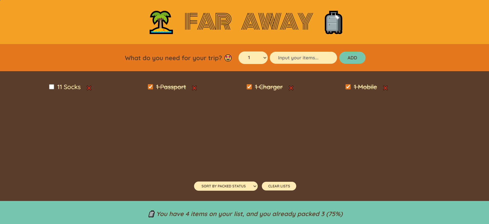

# Far Away

This is the **Far Away** project, built using **React.js** as a framework for creating a dynamic user interface.

### Project Overview

This app helps users manage a packing list for trips, allowing them to add, remove, and mark items as packed.

### Preview:

## How to Run the Project

1. Clone this repository.
2. Install dependencies by running `npm install`.
3. Start the application using `npm start`.

Enjoy your trip with a well-organized packing list! 🧳🌍
